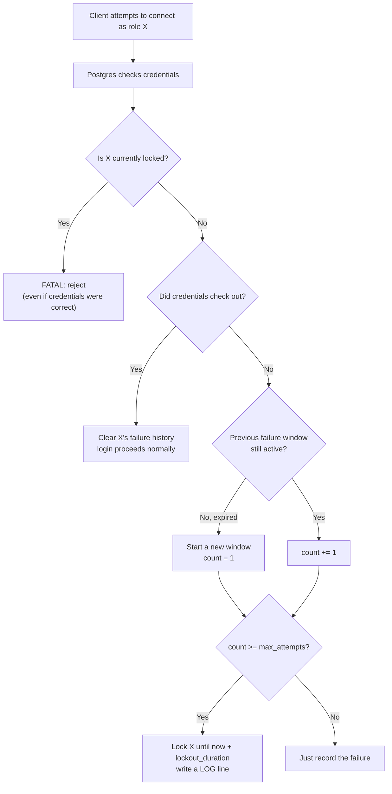

# Introduction to pg_login_guard

A PostgreSQL extension that locks a role out after too many failed login
attempts in a row — fail2ban-style, but built into the server itself.

> If role `X` fails to authenticate `max_attempts` times within a rolling
> `window`, it is locked for `lockout_duration` — further connection
> attempts (even with the correct password) are rejected until the
> lockout expires or an administrator unlocks it manually.

For build/install instructions, security considerations, and performance
notes, see [README.md](README.md). This document is about *how it works
and what it does*.

## How it works

`pg_login_guard` hooks directly into PostgreSQL's authentication path via
`ClientAuthentication_hook` — a hook the server calls on **every single
connection attempt**, right after it has determined whether the supplied
credentials were valid, but before that result is acted on. Because it
sits at the C/hook level rather than the SQL level, it sees every real
authentication attempt (password, SCRAM, md5, cert, whatever
`pg_hba.conf` specifies) for every role — not just app-level logins your
own code happens to log.

All state (who's failed how many times, who's currently locked) lives in
a small fixed-size table in **shared memory**, guarded by one lightweight
lock — not a catalog table. That's deliberate: writing to a real table
from inside an authentication hook would need a transaction in a context
where one may not safely exist yet, and it'd persist failed-login noise
into WAL/backups for no benefit. The tradeoff is that state resets on
server restart, same as fail2ban's in-memory ban list.

### Step by step, per connection attempt



1. **Locked check first.** If the role already has an active lock, the
   connection is rejected with `FATAL` — regardless of whether the
   password this time was actually correct. This is what makes it a real
   lockout and not just a counter: a correct password doesn't let you
   back in early.
2. **Success clears history.** If authentication just succeeded and the
   role wasn't locked, any tracking record for it is deleted. A clean
   login resets the slate.
3. **Failure advances the counter.** If authentication failed: if the
   previous failure window has expired, a fresh window starts at count 1;
   otherwise the count increments.
4. **Threshold trips the lock.** Once the count reaches `max_attempts`
   within `window`, the role is locked for `lockout_duration`, and a line
   is written to the server log.
5. **Auto-expiry.** Nothing has to happen for the lock to lift — the next
   connection attempt after `locked_until` simply proceeds normally,
   because step 1 no longer finds an active lock.

## Features

- **Tracks real server-level auth**, not just your app's login form —
  works for `psql`, connection poolers, any client.
- **Timed lockout with auto-unlock** — no admin has to intervene for
  normal operation.
- **Rolling window, not a fixed daily bucket** — old failures eventually
  stop counting (see the [window semantics nuance](#window-is-anchored-not-a-sliding-clock)
  below for exactly how).
- **Successful login resets the count** — occasional typos don't
  accumulate toward a lockout.
- **Admin visibility and override**, via three SQL functions installed by
  `CREATE EXTENSION`:

  | Function | Purpose | Access |
  |---|---|---|
  | `pg_login_guard_status()` | Lists every currently-tracked role: name, failed-attempt count, window start, lock expiry (`NULL` if not locked) | superuser only |
  | `pg_login_guard_unlock(role_name)` | Clears a lock immediately, before it would naturally expire | superuser only |
  | `pg_login_guard_reset(role_name)` | Wipes all tracking history for a role (as if it never failed) | superuser only |

- **Fails safe under load** — if the shared tracking table fills up, new
  entries are just dropped with a `WARNING` in the log rather than
  crashing or blocking connections (see the capacity note under
  `max_tracked_roles` below, and the fake-username exhaustion caveat in
  [README.md](README.md#security-considerations)).
- **Near-zero overhead** — no disk I/O, no catalog writes, one
  hash-table operation under a brief lock per connection attempt (see
  [README.md](README.md#performance)).

## GUC parameters

All go in `postgresql.conf` (or `ALTER SYSTEM`), and `pg_login_guard`
must be listed in `shared_preload_libraries` for any of this to run at
all:

| Parameter | Default | Reloadable? | Meaning |
|---|---|---|---|
| `pg_login_guard.enabled` | `on` | Yes (`SIGHUP`) | Kill switch — turn tracking/locking off without restarting or removing the library. |
| `pg_login_guard.max_attempts` | `5` | Yes (`SIGHUP`) | Number of failures within `window` before a role gets locked. |
| `pg_login_guard.window` | `5min` | Yes (`SIGHUP`) | Time span failures are counted within. Accepts unit suffixes (`s`, `min`, `h`). |
| `pg_login_guard.lockout_duration` | `15min` | Yes (`SIGHUP`) | How long a role stays locked once tripped. |
| `pg_login_guard.max_tracked_roles` | `1000` | **No** (`PGC_POSTMASTER` — requires restart) | Capacity of the shared-memory table; sizes it at server startup. |

Example:

```conf
shared_preload_libraries = 'pg_login_guard'

pg_login_guard.max_attempts = 5
pg_login_guard.window = '5min'
pg_login_guard.lockout_duration = '15min'
pg_login_guard.max_tracked_roles = 1000
```

Everything except `max_tracked_roles` can be tuned live with
`pg_ctl reload` / `SELECT pg_reload_conf()` — no restart, no dropped
connections.

## Practical example, with the config above

### Someone brute-forcing role `alice`

| Time | Event | What the extension does | `alice`'s state after |
|---|---|---|---|
| 09:00:00 | wrong password #1 | new tracking entry created | count=1, window started 09:00:00 |
| 09:00:15 | wrong password #2 | 15s since window start (< 5min) → count++ | count=2 |
| 09:00:30 | wrong password #3 | still within window → count++ | count=3 |
| 09:00:45 | wrong password #4 | still within window → count++ | count=4 |
| 09:01:00 | wrong password #5 | count reaches `max_attempts` (5) → **lock** | count=5, **locked until 09:16:00** (09:01 + 15min), a `LOG` line is written |
| 09:01:05 | **correct** password | role is locked → rejected anyway, `FATAL` | still locked |
| 09:10:00 | correct password again | still locked (09:10 < 09:16) → rejected | still locked |
| 09:16:01 | correct password | lock has expired on its own → login succeeds, no admin needed | **entry cleared** — clean slate |

The server log would show:

```
LOG:  pg_login_guard: role "alice" locked for 900 seconds after 5 failed login attempts within 300 seconds
```

And every rejected attempt between 09:01:00 and 09:16:00 — even with the
right password — gets:

```
FATAL:  role "alice" is temporarily locked due to repeated failed login attempts
DETAIL:  Locked until 2026-08-16 09:16:00+00.
HINT:  Wait for the lockout to expire, or ask an administrator to run pg_login_guard_unlock('alice').
```

A realistic automated attacker will burn through 5 attempts in a second
or two, not spread over 5 minutes — so in practice the `window` barely
matters for the *initial* burst, and the `lockout_duration` (15 min) is
what's actually doing the protective work, by making each retry cycle
expensive.

### A legitimate user who just mistypes

| Time | Event | Result |
|---|---|---|
| 14:00:00 | typo | count=1 |
| 14:00:20 | typo again | count=2 |
| 14:00:35 | gets it right | **success wipes the entry entirely** — count goes back to zero, no penalty carried forward, nothing to unlock |

Two typos never risk a lockout on their own — you'd need 5 in a row
without a success in between.

### Window is anchored, not a sliding clock

`window` starts at the **first** failure of a streak, and only resets if
a *new* failure arrives after that original window has elapsed — it does
not measure "gap since the *previous* attempt." Example with the same
config:

| Time | Since window start | Result |
|---|---|---|
| 08:00:00 | — | count=1, window started 08:00:00 |
| 08:04:00 | 4 min (< 5min) | count=2 |
| 08:07:00 | 7 min (> 5min) | **resets**: count=1, window restarts at 08:07:00 — even though only 3 minutes passed since the *previous* attempt |

So a patient attacker spacing failures more than 5 minutes apart from the
start of each streak will never trip the lock at all with this config —
they'd need to land 5 failures inside any single 5-minute span. That's
expected/intentional (it's what stops fast brute-forcing without
punishing someone who fat-fingers their password twice a week), just
worth knowing it's not "the last 5 minutes on a sliding clock."

### Where `max_tracked_roles = 1000` comes in

The extension keeps a fixed-size table for up to 1000 *distinct*
usernames being tracked at once — real or attempted. If you have, say,
50 real application roles, this config leaves huge headroom. It only
becomes relevant if something (a scanner, a botnet) hammers the server
with hundreds of different bogus usernames — after 1000 distinct ones
are being tracked simultaneously, new ones stop being recorded (logged
as a `WARNING`) until old entries clear out. Worth glancing at
`pg_login_guard_status()` occasionally, or watching the log for that
warning, if this server is internet-facing. See
[README.md](README.md#security-considerations) for more on this as a
potential denial-of-service vector.
